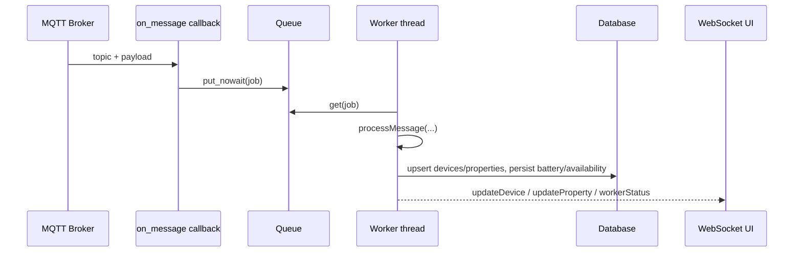

# z2m - Technical Reference

## Module Structure

Core files:

| File | Responsibility |
| --- | --- |
| `plugins/z2m/__init__.py` | Plugin lifecycle, MQTT client, queue worker, routing, link processing |
| `plugins/z2m/models/z2m.py` | SQLAlchemy models (`ZigbeeDevices`, `ZigbeeProperties`) |
| `plugins/z2m/forms/SettingForms.py` | Admin settings form (`host`, `port`, `login`, `password`, `topic`) |
| `plugins/z2m/templates/z2m.html` | Main admin page |
| `plugins/z2m/templates/z2m_device.html` | Device editor page |
| `plugins/z2m/static/js/devices.js` | Frontend logic, WebSocket handling, filtering/sorting |
| `plugins/z2m/templates/widget_z2m.html` | Dashboard widget |

---

## Runtime Architecture

The module uses:

- one Paho MQTT client;
- one bounded in-memory queue (`queue_max_size`, default `1000`);
- one worker thread that consumes queued messages and processes device/property updates.



### Lifecycle

1. `initialization()` starts worker and attempts MQTT connection.
2. `on_connect()` subscribes to configured topics.
3. `on_message()` parses topic/payload and enqueues jobs.
4. `_worker_loop()` consumes queue and runs `processMessage(...)`.
5. `cyclic_task()` waits until stop event; on stop it disconnects MQTT and worker.

---

## Data Model

### `ZigbeeDevices` (`zigbeedevices`)

| Field | Type | Meaning |
| --- | --- | --- |
| `id` | integer | Primary key |
| `title` | string | Friendly name or IEEE address fallback |
| `ieeaddr` | string | IEEE address |
| `availability` | string | Last persisted online/offline |
| `description` | string | User-facing description |
| `is_hub` | integer | Marks coordinator/bridge-like record |
| `is_battery` | integer | Battery-powered marker |
| `battery_level` | integer | Last battery value |
| `full_path` | string | MQTT base path used for `/set` and `/get` |
| `manufacturer_id` | string | Manufacturer ID |
| `model` | string | Zigbee model id |
| `model_name` | string | Secondary model name |
| `model_description` | string | Model description |
| `vendor` | string | Vendor |

### `ZigbeeProperties` (`zigbeeproperties`)

| Field | Type | Meaning |
| --- | --- | --- |
| `id` | integer | Primary key |
| `device_id` | integer | Parent device |
| `title` | string | Property name (e.g. `state`, `temperature`, `availability`) |
| `converter` | integer | Converter mode |
| `min_period` | integer | Minimal period gate |
| `round` | integer | Numeric rounding precision |
| `read_only` | integer | Read-only mode for reverse links |
| `process_type` | integer | Processing mode (`0` only changed, `1` all) |
| `linked_object` | string | Object name |
| `linked_property` | string | Object property name |
| `linked_method` | string | Object method name |

---

## MQTT and Topic Processing

### Subscription

Configured topic string is split by comma, and each topic is subscribed in `on_connect()`.

### Incoming message normalization

`on_message()`:

1. ignores topics containing `/set`;
2. detects bridge traffic (`bridge/` in topic);
3. strips configured prefixes to derive device identifier;
4. if payload is scalar and topic includes a property suffix, wraps it into JSON;
5. enqueues normalized job.

Queue overflow is handled by dropping new message with warning when queue is full.

### Outbound publish

`mqttPublish()` checks client and connection state, then publishes.

Control methods:

- `changeLinkedProperty(...)` publishes converted value to `<full_path>/set`;
- `set_payload(device_name, payload)` publishes direct payload for admin/API calls.

If cached availability is `offline`, module sends `<full_path>/get` first, waits `0.4s`, then sends `/set`.

---

## Device and Property Update Flow

`processMessage(path, did, value, hub)` handles:

- lazy device creation by `title` or `ieeaddr`;
- bridge device lists (`type=devices` or serialized `devices`);
- bridge `device_announce` updates;
- regular JSON state payloads;
- `/availability` payload mapping to `availability` property.

Batch behavior:

- accumulates side effects, battery updates, and availability updates;
- persists battery/availability in DB in one session;
- stores runtime values in cache;
- sends WebSocket updates for device and properties.

---

## Converters

### Inbound conversion (`process_data`)

| Converter | Behavior |
| --- | --- |
| `0` or `None` | Auto map false/off/no/open -> `0`; true/on/yes/close -> `1` |
| `1` | No conversion |
| `2` | `offline -> 0`, `online -> 1` |
| `3` | Convert XY color JSON to hex RGB |
| `4` | Convert datetime string (`%Y-%m-%d %H:%M:%S`) to unix timestamp |
| `5` | Convert value `0..254` to percent |
| `6` | Normalize ON-like values to `1`, else `0` |
| `7` | Normalize OPEN-like values to `1`, else `0` |
| `8` | Normalize LOCK-like values to `1`, else `0` |

### Reverse conversion (`changeLinkedProperty`)

For values coming from osysHome object property links:

- converter `2` maps `0/1` to `offline/online`;
- converter `3` maps hex color to XY JSON;
- converter `5` maps percent to `0..254`;
- converters `6/7/8` map to `ON/OFF`, `OPEN/CLOSE`, `LOCK/UNLOCK`.

---

## Linking Semantics

When property update is accepted:

- if `linked_method` is set, `callMethodThread(...)` is called;
- if `linked_property` is set:
  - `process_type == 1`: `setPropertyThread(...)`
  - otherwise: `updatePropertyThread(...)`

`read_only` affects reverse registration in admin save path (`setLinkToObject` is skipped for read-only properties).

`changeObject(...)` is used to rename/clear stored object links when object manager changes object/property/method names.

---

## REST API

All routes below are admin protected.

### Admin pages

| Method | Path | Purpose |
| --- | --- | --- |
| `GET` | `/z2m` | Main admin page |
| `GET` | `/z2m/device/<device_id>` | Device details for editor |
| `POST` | `/z2m/device/<device_id>` | Save device description and property link settings |
| `GET`/`POST` | `/z2m/delete_prop/<prop_id>` | Delete property record |

### JSON API

| Method | Path | Purpose |
| --- | --- | --- |
| `GET` | `/z2m/api/devices` | List devices with linked runtime values |
| `POST` | `/z2m/api/settings` | Save MQTT settings and reconnect |
| `POST` | `/z2m/api/device/set_prop` | Send one property value to device (`set_payload`) |
| `GET` | `/z2m/api/worker_status` | Worker and queue status |

---

## WebSocket Events

Channel name used by frontend:

```text
z2m
```

Outgoing operations:

| Operation | Payload |
| --- | --- |
| `connectionStatus` | `{ connected, configured }` |
| `workerStatus` | `{ running, queue_size, queue_max }` |
| `updateDevice` | `{ id, updated, availability? }` |
| `updateProperty` | Property runtime object with `value`, `converted`, `updated`, links |

The admin UI subscribes/unsubscribes based on page visibility.

---

## Frontend Behavior

`static/js/devices.js` provides:

- initial API fetch (`/z2m/api/devices`);
- settings modal save (`/z2m/api/settings`);
- Socket.IO processing of `z2m` operations;
- device filtering by text and status;
- sorting by key columns;
- worker queue load indication.

Device editor (`z2m_device.html`) provides:

- object list fetch from `/api/object/list/details`;
- editing links, converter, process type, read-only, round, minimal period;
- direct set-value action via `/z2m/api/device/set_prop`.

---

## Search Integration

`search(query)` returns:

- device hits (`title`, `description`, `ieeaddr`);
- property hits (`title`, `linked_object`, `linked_property`, `linked_method`),
  with links back to the device editor.

---

## Known Caveats

> [!NOTE]
> `min_period` is stored and processed in milliseconds.

Other caveats:

- queue full condition drops incoming messages;
- many runtime values are cache-first and may require live traffic to populate immediately after restart;
- `battery_warn` threshold in API uses mixed ranges (`<30` then `<360`) due heterogeneous battery scales.

---

## See Also

- [User Guide](USER_GUIDE.md)
- [Module index](index.md)
