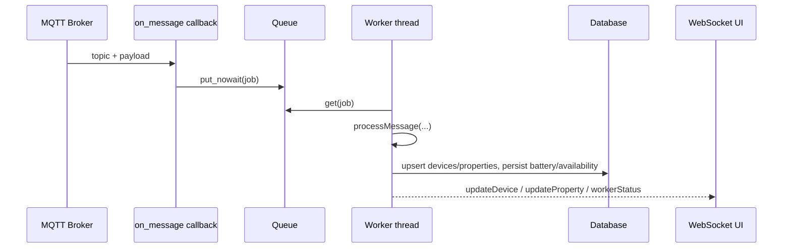

# z2m - Техническая документация

## Структура модуля

Основные файлы:

| Файл | Назначение |
| --- | --- |
| `plugins/z2m/__init__.py` | Жизненный цикл плагина, MQTT-клиент, очередь/воркер, маршруты, обработка связей |
| `plugins/z2m/models/z2m.py` | SQLAlchemy-модели (`ZigbeeDevices`, `ZigbeeProperties`) |
| `plugins/z2m/forms/SettingForms.py` | Форма настроек (`host`, `port`, `login`, `password`, `topic`) |
| `plugins/z2m/templates/z2m.html` | Основная админ-страница |
| `plugins/z2m/templates/z2m_device.html` | Страница редактирования устройства |
| `plugins/z2m/static/js/devices.js` | Фронтенд-логика, обработка WebSocket, фильтрация/сортировка |
| `plugins/z2m/templates/widget_z2m.html` | Виджет панели управления |

---

## Архитектура выполнения

Модуль использует:

- один Paho MQTT-клиент;
- одну ограниченную in-memory очередь (`queue_max_size`, по умолчанию `1000`);
- один воркер-поток, который читает очередь и выполняет обработку обновлений устройств/свойств.



### Жизненный цикл

1. `initialization()` запускает воркер и пытается подключиться к MQTT.
2. `on_connect()` подписывается на настроенные топики.
3. `on_message()` парсит topic/payload и кладет задания в очередь.
4. `_worker_loop()` забирает задания из очереди и запускает `processMessage(...)`.
5. `cyclic_task()` ждет флаг остановки; при остановке отключает MQTT и воркер.

---

## Модель данных

### `ZigbeeDevices` (`zigbeedevices`)

| Поле | Тип | Смысл |
| --- | --- | --- |
| `id` | integer | Первичный ключ |
| `title` | string | Friendly name или fallback по IEEE адресу |
| `ieeaddr` | string | IEEE-адрес |
| `availability` | string | Последнее сохраненное состояние online/offline |
| `description` | string | Пользовательское описание |
| `is_hub` | integer | Признак координатора/bridge-записи |
| `is_battery` | integer | Признак батарейного устройства |
| `battery_level` | integer | Последний уровень батареи |
| `full_path` | string | MQTT-база для `/set` и `/get` |
| `manufacturer_id` | string | ID производителя |
| `model` | string | ID модели Zigbee |
| `model_name` | string | Дополнительное имя модели |
| `model_description` | string | Описание модели |
| `vendor` | string | Производитель |

### `ZigbeeProperties` (`zigbeeproperties`)

| Поле | Тип | Смысл |
| --- | --- | --- |
| `id` | integer | Первичный ключ |
| `device_id` | integer | Родительское устройство |
| `title` | string | Имя свойства (например `state`, `temperature`, `availability`) |
| `converter` | integer | Режим конвертера |
| `min_period` | integer | Ограничение минимального периода |
| `round` | integer | Точность округления чисел |
| `read_only` | integer | Режим только чтения для обратных связей |
| `process_type` | integer | Режим обработки (`0` только изменения, `1` всегда) |
| `linked_object` | string | Имя объекта |
| `linked_property` | string | Имя свойства объекта |
| `linked_method` | string | Имя метода объекта |

---

## MQTT и обработка топиков

### Подписка

Строка топиков из настроек делится по запятой, и каждый топик подписывается в `on_connect()`.

### Нормализация входящих сообщений

`on_message()`:

1. игнорирует топики, содержащие `/set`;
2. определяет bridge-трафик (`bridge/` в topic);
3. убирает настроенные префиксы для вычисления идентификатора устройства;
4. если payload скалярный и в topic есть хвост свойства, оборачивает payload в JSON;
5. кладет нормализованное задание в очередь.

Если очередь заполнена, новые сообщения отбрасываются с предупреждением.

### Исходящий publish

`mqttPublish()` проверяет наличие клиента и состояние подключения, затем публикует сообщение.

Управляющие методы:

- `changeLinkedProperty(...)` публикует преобразованное значение в `<full_path>/set`;
- `set_payload(device_name, payload)` публикует прямой payload для admin/API-вызовов.

Если в кэше `availability=offline`, модуль сначала отправляет `<full_path>/get`, ждет `0.4s`, затем отправляет `/set`.

---

## Поток обновления устройств и свойств

`processMessage(path, did, value, hub)` обрабатывает:

- ленивое создание устройства по `title` или `ieeaddr`;
- списки устройств от bridge (`type=devices` или сериализованное `devices`);
- сообщения bridge `device_announce`;
- обычные JSON state payload;
- `/availability` c маппингом в свойство `availability`.

Batch-поведение:

- собирает сайд-эффекты, обновления батареи и availability;
- сохраняет battery/availability в БД одной сессией;
- пишет runtime-значения в кэш;
- отправляет WebSocket-обновления устройства и свойств.

---

## Конвертеры

### Входящая конвертация (`process_data`)

| Конвертер | Поведение |
| --- | --- |
| `0` или `None` | Автомаппинг false/off/no/open -> `0`; true/on/yes/close -> `1` |
| `1` | Без конвертации |
| `2` | `offline -> 0`, `online -> 1` |
| `3` | Конвертация XY JSON в hex RGB |
| `4` | Конвертация datetime-строки (`%Y-%m-%d %H:%M:%S`) в unix timestamp |
| `5` | Конвертация значения `0..254` в проценты |
| `6` | Нормализация ON-подобных значений в `1`, иначе `0` |
| `7` | Нормализация OPEN-подобных значений в `1`, иначе `0` |
| `8` | Нормализация LOCK-подобных значений в `1`, иначе `0` |

### Обратная конвертация (`changeLinkedProperty`)

Для значений, приходящих из связанных свойств osysHome:

- конвертер `2` маппит `0/1` в `offline/online`;
- конвертер `3` маппит hex-цвет в XY JSON;
- конвертер `5` маппит проценты в `0..254`;
- конвертеры `6/7/8` маппят в `ON/OFF`, `OPEN/CLOSE`, `LOCK/UNLOCK`.

---

## Семантика связей

Когда обновление свойства принято:

- если задан `linked_method`, вызывается `callMethodThread(...)`;
- если задан `linked_property`:
  - `process_type == 1`: `setPropertyThread(...)`
  - иначе: `updatePropertyThread(...)`

`read_only` влияет на регистрацию обратной связи в обработчике сохранения админки (`setLinkToObject` не вызывается для read-only свойств).

`changeObject(...)` используется для переименования/очистки ссылок, когда в менеджере объектов меняется имя объекта, свойства или метода.

---

## REST API

Все перечисленные маршруты защищены правами администратора.

### Админ-страницы

| Метод | Путь | Назначение |
| --- | --- | --- |
| `GET` | `/z2m` | Главная страница модуля |
| `GET` | `/z2m/device/<device_id>` | Детали устройства для редактора |
| `POST` | `/z2m/device/<device_id>` | Сохранение описания устройства и настроек свойств |
| `GET`/`POST` | `/z2m/delete_prop/<prop_id>` | Удаление записи свойства |

### JSON API

| Метод | Путь | Назначение |
| --- | --- | --- |
| `GET` | `/z2m/api/devices` | Список устройств с runtime-значениями связанных свойств |
| `POST` | `/z2m/api/settings` | Сохранение MQTT-настроек и переподключение |
| `POST` | `/z2m/api/device/set_prop` | Отправка одного значения свойства в устройство (`set_payload`) |
| `GET` | `/z2m/api/worker_status` | Состояние воркера и очереди |

---

## WebSocket-события

Имя канала, на который подписывается фронтенд:

```text
z2m
```

Операции, отправляемые модулем:

| Operation | Payload |
| --- | --- |
| `connectionStatus` | `{ connected, configured }` |
| `workerStatus` | `{ running, queue_size, queue_max }` |
| `updateDevice` | `{ id, updated, availability? }` |
| `updateProperty` | Runtime-объект свойства с `value`, `converted`, `updated`, links |

Админ-UI подписывается/отписывается в зависимости от видимости вкладки.

---

## Поведение фронтенда

`static/js/devices.js` реализует:

- начальную загрузку устройств (`/z2m/api/devices`);
- сохранение настроек в модальном окне (`/z2m/api/settings`);
- обработку Socket.IO-событий `z2m`;
- фильтрацию устройств по тексту и статусу;
- сортировку по ключевым столбцам;
- индикацию загрузки очереди воркера.

Редактор устройства (`z2m_device.html`) реализует:

- загрузку списка объектов из `/api/object/list/details`;
- настройку links, converter, process type, read-only, round, minimal period;
- прямую отправку значения через `/z2m/api/device/set_prop`.

---

## Интеграция с поиском

`search(query)` возвращает:

- совпадения по устройствам (`title`, `description`, `ieeaddr`);
- совпадения по свойствам (`title`, `linked_object`, `linked_property`, `linked_method`)
  со ссылками на редактор устройства.

---

## Известные нюансы

> [!NOTE]
> `min_period` хранится и обрабатывается в миллисекундах.

Дополнительно:

- при переполнении очереди входящие сообщения отбрасываются;
- многие runtime-значения cache-first и после рестарта могут появляться только после нового трафика;
- порог `battery_warn` в API использует смешанные диапазоны (`<30`, затем `<360`) из-за неоднородных шкал батареи.

---

## См. также

- [Руководство пользователя](USER_GUIDE.ru.md)
- [Индекс модуля](index.ru.md)
